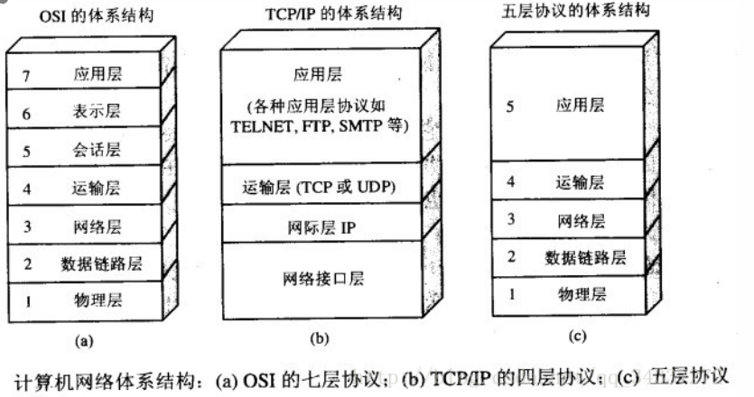

计算机网络
========

## OSI与TCP/IP各层的机构与功能都有哪些协议？

- 应用层
>应用层(application-layer)的任务是通过应用进程的交互来完成特定网络应用。应用层协议定义的是应用　进程(进程：主机中真正运行的程序)间的通信和交互的规则。对于不同的网络应用需要不同的应用协议。在互联网中应用层协议很多，如域名系统ＤＮＳ,支持万维网应用的HTTP协议，支持电子邮件的SMTP协议等等。我们把应用层交互的数据单元称为报文。
- 运输层
>运输层(transport layer)的任务就是负责向两台主机进程之间的通信提供通用的数据传输服务。应用进程利用该服务传送应用层报文。“通用的”是指并不针对某一个特定的网络应用，而是多种应用可以使用同一运输层访问。由于一台主机可同时运行多个线程，因此运输层有复用和分用的功能。所谓复用就是指多个应用层进程可同时使用下面运输层的服务，分用和复用相反，是运输层把收到的信息分别交付上面应用层中的相应进程。

>传输控制协议(Transmission Control Protocol)：提供面向连接，可靠的数据传输服务。

>用户数据报协议(User Datagram Protocol)：提供无连接的，尽最大努力的数据传输服务（不保证数据传输的可靠性）
- 网络层
>
- 数据链路层
>
- 物理层
