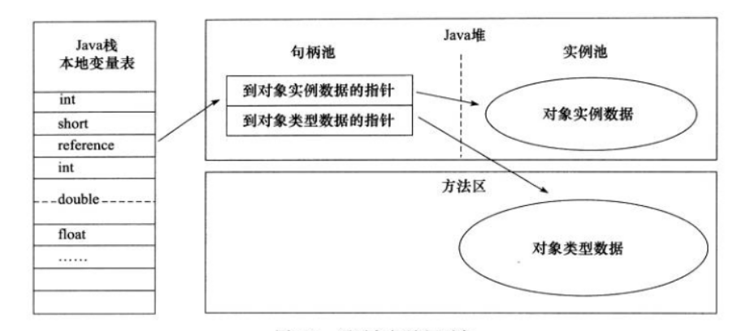
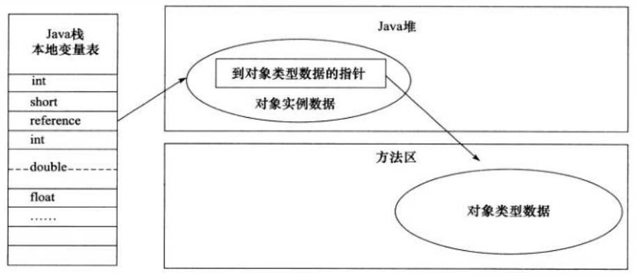

JVM
===

## 线程私有
- 程序计数器
- 本地方法栈
- 虚拟机栈

## 程序计数器
>字节码通过改变程序计数器来依次读取指令，从而实现代码流程控制，如：顺序执行，选择，循环，异常处理。

>在多线程的情况下，程序计数器用于记录当前线程执行的位置，从而当前线程被切换回来的时候能够知道该线程上次运行到哪里了。

>\[注]:程序计数器是唯一一个不会出现OutOfMemoryError的内存区域，他的生命周期随着线程的创建而创建随着线程的结束而消亡。

## Java 虚拟机栈

>与程序计数器一样Ｊａｖａ虚拟机栈也是线程私有的，他的生命周期和线程相同，描述的是Ｊａｖａ方法执行的内存模型，每次方法调用的数据是通过栈传递的。

```
Java的内存可以粗糙的区分为堆内存（Ｈｅａｐ)和栈内存（Ｓtack）, 其中栈就是现在说的虚拟机栈，或者是虚拟机中的局部变量表部分。  
实际上java虚拟机是由一个个栈帧组成，而每个栈帧中都拥有：
局部变量表
操作数栈
动态链接
方法出口信息
```

>局部变量表主要存放了编译器可知的各种数据类型（boolean,byte,char,short,int,float,long,double）、对象引用（reference类型，它不同于对象本身，可能是一个指向对象起始地址的引用指针，也可能是指向一个代表虚对象的句柄或其他与此对象的相关引用的位置）、

>Java虚拟机会出现两种异常：StackOverFlowError和OutOfMemoryError

- StackOverFlowError:
    若Java虚拟机栈的内存大小不允许动态扩展，那么当线程请求栈的深度超过当前Java虚拟机栈的最大深度时，就抛出StackOverError异常。
- OutMemoryError:
    若Java虚拟机栈的内存大小不允许动态扩展，且当线程请求栈时内存用完了，无法再动态扩展了，此时抛出OutOfMemoryError

## 本地方法栈

>和虚拟机所发挥的作用非常相似，区别是：虚拟机栈为虚拟机执行Java方法（也就是字节码）服务，而本地方法栈则为虚拟机使用到的Native方法服务。在HotSpot虚拟机中和Java虚拟机栈合二为一。

## 堆

>Java虚拟机所管理的内存中最大的一块、Java堆是所有线程共享的一块内存区域，在虚拟机启动时创建。此内存区域的唯一目的就是存放对象实例，几乎所有的对象实例以及数组都在这里分配内存。

`对象晋升到老年代的年龄阀值，可通过参数　-XX:MaxTenuringThreshold　来设置`

## 方法区

>方法区和Java堆一样，是各个线程共享的内存区域，它用于存储已被虚拟机加载的类信息、常量、静态变量、即时编译器编译后的代码数据。虽然Java虚拟机规范把方法区描述为堆的一个逻辑部分，但它却有一个别名叫做Non-Heap（非堆）,目的是与Java堆区分开来。

`-XX:MetaspaceSize=N`设置Metaspace的初始(和最小值)  
`-XX:MaxMetaspaceSize=N`设置Metaspace的最大大小

## 直接内存

>直接内存并不是虚拟机运行时数据区的一部分，也不是虚拟机规范中定义的内存区域，但是这部分内存也被频繁的使用。而且可能导致OutOfMemoryError异常出现

## Java对象创建的过程

>1.类加载检查：虚拟机遇到一条new指令时，首先将去检查这个指令的参数是否能在常量池中定位到这个类的符号引用，并且检查这个符号引用代表的类是否已经被加载过、解析和初始化过。如果没有那必须先执行相应的类的加载过程。

>2.分配内存：在类加载检查通过后，接下来的虚拟机将为新生对象分配内存。对象所需的内存大小在类加载完成后便可确定，为对象分配空间的任务等同于把一块确定大小的内存从Java堆中划分出来。分配的方式有“指针碰撞”和”空闲列表“两种，选择哪种分配方式由Java堆是否规整又由所采取的垃圾收集器是否带有压缩整理功能决定。

>3.初始化零值: 内存分配完成后，虚拟机需要将分配到的内存空间都初始化为零值（不包括对象头），这一步操作保证了对象的实例在Java代码中可以不赋初始值就可以直接使用，程序能访问这些字段的数据类型所对应的零值。

>4.设置对象头：初始化零值之后，虚拟机要对对象进行必要的设置，例如这个对象是哪个类的实例、如何才能找到类的元数据信息、对象的哈希码、对象的ＧＣ分代年龄等信息。这些信息存放在对象头中。另外根据虚拟机当前运行状态的不同，如是否启用偏向锁等，对象头会有不同的设置方式。

>5.执行Init方法：把对象按照程序员的意愿进行初始化，这样一个真正可用的对象才算完全产生出来。

\[注]：内存分配并发问题　　
- CAS+失败重试
- TLAB

## 对象访问定位方式
- 句柄
`如果使用句柄的话，那么Java堆中将划分出一块内存来作为句柄池，reference中存储的就是对象的句柄地址，而句柄中包含了对象实例数据与类型数据各自的具体地址信息`

- 直接指针
`如果使用直接指针访问，那么Java堆对象的布局中就必须考虑如何放置访问类型数据的相关信息，而reference中存储的直接就是对象的地址。`


## 堆内存中对象的分配的基本策略

<table>
    <tr><td>eden</td><td>s0</td><td>s1</td><td>tentired</td></tr>
</table>

>eden、s0、s1都是属于新生代，tentired属于老年代。大部分情况，对象都会在Eden区域分配，在一次新生代垃圾回收后，如果对象还存活，则会进入s0或者s1，并且对象的年龄还会＋１（伊甸园区－>幸存区后的对象的初始年龄变为１）,当他的年龄到一定程度（默认１５岁）就会被晋升到老年代中。对象的晋升到老年代的年龄阀值可以通过　-XX:MaxTenuringThreshold来设置。

>另外，大对象和长期存活的对象会直接进入老年代


## Minor GC 和　Full GC　异同？

>大多数情况下，对象在新生代中的伊甸园区分配。当伊甸园区没有足够空间进行分配时，虚拟机将发起一次Minor GC

>新生代GC(MinorGC):指发生在新生代的垃圾收集动作，Minor GC非常频繁，回收速度也比较快。

>老年代GC(MajorGC/FullGC):指发生在老年代的GC，出现Major GC经常会伴随至少一次Minor GC（并发绝对）,Major GC的速度一般会比Minor GC慢十倍以上。

## 判断对象是否死亡

- 引用计数法
>给对象中添加一个引用计数器，每当有一个地方引用它，计数器就加１；当引用失效，计数器就减１；任何时候计数器为０的对象就是不可能再被使用的。
- 可达性分析法
>这个算法的基本思路就是通过一系列的称为”GC Roots“的对象作为起点，从这些起点开始向下搜索，节点所走过的路径称为引用链，当一个对象到GC Roots没有任何链相连的话，则证明此对象是不可用的。


##　强、弱、软、虚引用

- 强引用(StrongReference)
>以前我们使用的
- 软引用(SoftReference)
>
- 弱引用(WeakReference)
>
- 虚引用(PhantomReference)
>