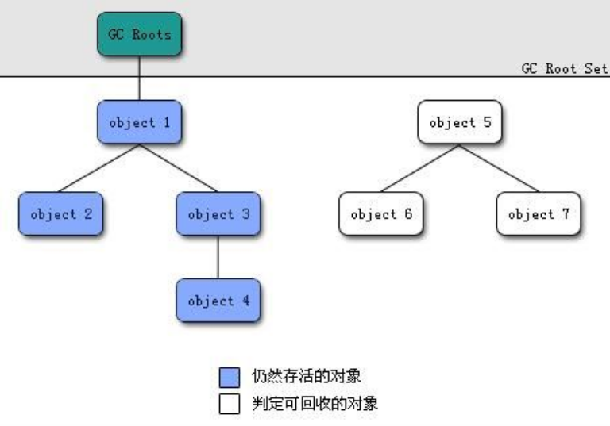

JVM
===

## 线程私有
- 程序计数器
- 本地方法栈
- 虚拟机栈

## 程序计数器
>字节码通过改变程序计数器来依次读取指令，从而实现代码流程控制，如：顺序执行，选择，循环，异常处理。

>在多线程的情况下，程序计数器用于记录当前线程执行的位置，从而当前线程被切换回来的时候能够知道该线程上次运行到哪里了。

>\[注]:程序计数器是唯一一个不会出现OutOfMemoryError的内存区域，他的生命周期随着线程的创建而创建随着线程的结束而消亡。

## Java 虚拟机栈

>与程序计数器一样Ｊａｖａ虚拟机栈也是线程私有的，他的生命周期和线程相同，描述的是Ｊａｖａ方法执行的内存模型，每次方法调用的数据是通过栈传递的。

```
Java的内存可以粗糙的区分为堆内存（Ｈｅａｐ)和栈内存（Ｓtack）, 其中栈就是现在说的虚拟机栈，或者是虚拟机中的局部变量表部分。  
实际上java虚拟机是由一个个栈帧组成，而每个栈帧中都拥有：
局部变量表
操作数栈
动态链接
方法出口信息
```

>局部变量表主要存放了编译器可知的各种数据类型（boolean,byte,char,short,int,float,long,double）、对象引用（reference类型，它不同于对象本身，可能是一个指向对象起始地址的引用指针，也可能是指向一个代表虚对象的句柄或其他与此对象的相关引用的位置）、

>Java虚拟机会出现两种异常：StackOverFlowError和OutOfMemoryError

- StackOverFlowError:
    若Java虚拟机栈的内存大小不允许动态扩展，那么当线程请求栈的深度超过当前Java虚拟机栈的最大深度时，就抛出StackOverError异常。
- OutMemoryError:
    若Java虚拟机栈的内存大小不允许动态扩展，且当线程请求栈时内存用完了，无法再动态扩展了，此时抛出OutOfMemoryError

## 本地方法栈

>和虚拟机所发挥的作用非常相似，区别是：虚拟机栈为虚拟机执行Java方法（也就是字节码）服务，而本地方法栈则为虚拟机使用到的Native方法服务。在HotSpot虚拟机中和Java虚拟机栈合二为一。

## 堆

>Java虚拟机所管理的内存中最大的一块、Java堆是所有线程共享的一块内存区域，在虚拟机启动时创建。此内存区域的唯一目的就是存放对象实例，几乎所有的对象实例以及数组都在这里分配内存。

`对象晋升到老年代的年龄阀值，可通过参数　-XX:MaxTenuringThreshold　来设置`

## 方法区

>方法区和Java堆一样，是各个线程共享的内存区域，它用于存储已被虚拟机加载的类信息、常量、静态变量、即时编译器编译后的代码数据。虽然Java虚拟机规范把方法区描述为堆的一个逻辑部分，但它却有一个别名叫做Non-Heap（非堆）,目的是与Java堆区分开来。

`-XX:MetaspaceSize=N`设置Metaspace的初始(和最小值)  
`-XX:MaxMetaspaceSize=N`设置Metaspace的最大大小

## 直接内存

>直接内存并不是虚拟机运行时数据区的一部分，也不是虚拟机规范中定义的内存区域，但是这部分内存也被频繁的使用。而且可能导致OutOfMemoryError异常出现

## Java对象创建的过程

>1.类加载检查：虚拟机遇到一条new指令时，首先将去检查这个指令的参数是否能在常量池中定位到这个类的符号引用，并且检查这个符号引用代表的类是否已经被加载过、解析和初始化过。如果没有那必须先执行相应的类的加载过程。

>2.分配内存：在类加载检查通过后，接下来的虚拟机将为新生对象分配内存。对象所需的内存大小在类加载完成后便可确定，为对象分配空间的任务等同于把一块确定大小的内存从Java堆中划分出来。分配的方式有“指针碰撞”和”空闲列表“两种，选择哪种分配方式由Java堆是否规整又由所采取的垃圾收集器是否带有压缩整理功能决定。

>3.初始化零值: 内存分配完成后，虚拟机需要将分配到的内存空间都初始化为零值（不包括对象头），这一步操作保证了对象的实例在Java代码中可以不赋初始值就可以直接使用，程序能访问这些字段的数据类型所对应的零值。

>4.设置对象头：初始化零值之后，虚拟机要对对象进行必要的设置，例如这个对象是哪个类的实例、如何才能找到类的元数据信息、对象的哈希码、对象的ＧＣ分代年龄等信息。这些信息存放在对象头中。另外根据虚拟机当前运行状态的不同，如是否启用偏向锁等，对象头会有不同的设置方式。

>5.执行Init方法：把对象按照程序员的意愿进行初始化，这样一个真正可用的对象才算完全产生出来。

\[注]：内存分配并发问题　　
- CAS+失败重试
- TLAB

## 对象访问定位方式
- 句柄
`如果使用句柄的话，那么Java堆中将划分出一块内存来作为句柄池，reference中存储的就是对象的句柄地址，而句柄中包含了对象实例数据与类型数据各自的具体地址信息`

- 直接指针
`如果使用直接指针访问，那么Java堆对象的布局中就必须考虑如何放置访问类型数据的相关信息，而reference中存储的直接就是对象的地址。`


## 堆内存中对象的分配的基本策略

<table>
    <tr><td>eden</td><td>s0</td><td>s1</td><td>tentired</td></tr>
</table>

>eden、s0、s1都是属于新生代，tentired属于老年代。大部分情况，对象都会在Eden区域分配，在一次新生代垃圾回收后，如果对象还存活，则会进入s0或者s1，并且对象的年龄还会＋１（伊甸园区－>幸存区后的对象的初始年龄变为１）,当他的年龄到一定程度（默认１５岁）就会被晋升到老年代中。对象的晋升到老年代的年龄阀值可以通过　-XX:MaxTenuringThreshold来设置。

>另外，大对象和长期存活的对象会直接进入老年代


## Minor GC 和　Full GC　异同？

>大多数情况下，对象在新生代中的伊甸园区分配。当伊甸园区没有足够空间进行分配时，虚拟机将发起一次Minor GC

>新生代GC(MinorGC):指发生在新生代的垃圾收集动作，Minor GC非常频繁，回收速度也比较快。

>老年代GC(MajorGC/FullGC):指发生在老年代的GC，出现Major GC经常会伴随至少一次Minor GC（并发绝对）,Major GC的速度一般会比Minor GC慢十倍以上。

## 判断对象是否死亡

- 引用计数法
>给对象中添加一个引用计数器，每当有一个地方引用它，计数器就加１；当引用失效，计数器就减１；任何时候计数器为０的对象就是不可能再被使用的。
- 可达性分析法
>这个算法的基本思路就是通过一系列的称为”GC Roots“的对象作为起点，从这些起点开始向下搜索，节点所走过的路径称为引用链，当一个对象到GC Roots没有任何链相连的话，则证明此对象是不可用的。



##　强、软、弱、虚引用

- 强引用(StrongReference)
>以前我们使用的大部分引用实际上都是强引用,这是最普遍的引用。如果一个对象具有强引用，那就类似于必不可少的生活用品，垃圾回收器不会回收它。当内存不足时Java虚拟机宁愿抛出异常ＯＯＭ错误，使程序异常终止，也不会靠随意回收具有强引用的对象来解决内存不足的问题。
- 软引用(SoftReference)
>如果一个对象具有软引用，那就类似可有可无的生活用品。如果内存空间足够，垃圾收集器就不会回收，如果内存不足，就会回收这些对象的内存。只要垃圾回收器没有回收它，该对象就可以被程序使用。软引用可用来实现内存敏感的高速缓存。
软引用可以和一个引用队列（ReferenceQueue）联合使用，如果软引用所引用的对象被垃圾回收，Java虚拟机就会把这个软引用加入到与之关联的引用队列中去。
- 弱引用(WeakReference)
>一旦垃圾收集器进行扫描，不管当前内存是否够用，都会回收他的内存。不过垃圾收集器是一个优先级很低的线程，因此不一定会很快发现那些具有弱引用的对象。弱引用可以和一个引用队列（ReferenceQueue）联合使用，如果弱引用所引用的对象被垃圾回收，Java虚拟机就会把这个弱引用加入到与之关联的引用队列中去。
- 虚引用(PhantomReference)
>”形同虚设“,虚引用并不会决定对象的生命周期。如果一个对象仅持有虚引用，那么它就和没有任何引用一样，在任何时候都可能被垃圾回收。虚引用主要用来追踪对象被垃圾回收的活动。

## 废弃常量

运行时常量池主要回收的就是废弃的常量。那么我们如何判断一个常量是废弃常量呢？
>假如在常量池中存在字符串”abc“，如果当前没有任何String引用该字符串常量的话，就说明常量"abc"就是废弃常量，如果这时发生内存回收的话而且有必要的话，”abc“就会被系统清理出常量池。

## 判断一个无用的类

>满足下列三个条件的无用类进行回收,但是并非必然

- 该类所有的实例都已经被回收，也即是Java堆中不存在该类的任何实例
- 加载该类的ClassLoader已经被回收
- 该类对应的java.lang.Class对象没有在任何地方被引用，无法在任何地方通过反射访问该类的方法。

## 垃圾收集器
（垃圾收集器就是内存回收的具体实现）

- Serial收集器
>串行收集器是最基本的、历史最悠久的垃圾收集器。单线程收集器。他的单线程的意义并不仅仅意味着它只会使用一天垃圾收集线程去完成垃圾收集，更重要的是它在进行垃圾收集工作的时候必须暂停其他所有的工作线程，（Stop The World）直到它收集结束。
新生代采用复制算法，老年代采用标记-整理算法。

>虚拟机设计者当然知道Stop The World带来的不良用户体验，所以在后续的垃圾收集器中停顿时间在不断缩短（仍然还有停顿，寻找最优秀的垃圾收集器的过程还在继续）但是相比Serial收集器有没有优于其他垃圾收集器的地方呢？当然有，它简单而高效（与其他垃圾收集器的单线程相比）。
Serial收集器由于没有线程交互的开销，自然可以获取很高的单线程收集效率。Serial收集器对于运行在Client模式下的虚拟机来说是个不错的选择。
- ParNew收集器
>ParNew收集器其实就是Serial收集器的多线程版本，除啦使用多线程垃圾收集外，其余行为(控制参数、收集算法、回收策略等等)和Serials收集器完全一样  

>他是许多运行在Server模式下的虚拟机的首要选择，除了Serial收集器外，只有它能与CMS收集器（真正意义上的并发收集器）配合工作

并行并发概念补充：
>并行(Parallel):指多条垃圾收集线程并行工作，但此时用户线程任然处于等待状态。

>并发(Concurrent):指用户线程与垃圾收集线程同时执行（但不一定并行，可能会交替执行）用户程序继续运行，而垃圾收集器运行在另一个CPU上

- Parallel Scavenge收集器
>Parallel Scavenge收集器类似于ParNew 那么他有什么特别之处？
``
-XX:+UseParallelGC   使用Parallel收集器+老年代串行
-XX:+UseParallelOldGC 使用Parallel收集器+老年代并行
``
>Parallel　Scavenge 收集器关注点是吞吐量（高效率的利用CPU）。CMS等垃圾收集器的关注点更多的是用户线程的停顿时间（提升用户体验）。所谓的吞吐量就是CPU中用于运行用户代码的时间与CPU总消耗时间的比值。Parallel　Scavenge收集器提供了很多参数供用户找到最合适的停顿时间或最大吞吐量，如果对于收集器运作不太了解的话，手工优化存在可以选择把内存管理优化交给虚拟机区完成也是一个不错的选择。

>新生代采用“复制算法，老年代采用标记-整理算法"  


Serial Old　收集器

>Serial 收集器的老年代版本，它同样是一个单线程收集器。他主要两大用途：一种是在JDK1.5以前的版本中与Parallel Scavenge 收集器搭配使用，另一种用途作为CMS收集器的后背方案。

Parallel Old　收集器

>Parallel Scavenge收集器的老年代版本。使用多线程和”标记－整理“算法。在注重吞吐量以及CPU资源的场合，都可以优先考虑Parallel　Scavenge收集器和Parallel　Old收集器。

- CMS收集器
>Concurrent Mark　Sweep　收集器是一种获取最短回收停顿时间为目标的收集器。它非常符合在注重用户体验的应用上使用。是HotSpot虚拟机第一款真正意义上的并发收集器，它第一次实现了让垃圾收集线程和用户线程同时工作的模式。　　


1.初始标记：暂停所有的其他线程，并记录下直接与root相连的对象，速度很快。
2.并发标记：同时开启GC和用户线程，用一个闭包结构区记录可达对象但在这个阶段结束，这个闭包结构并不能保证包含当前所有的可达对象。因为用户线程可能会不断地更新引用域，所以GC线程无法保证可达性分析的实时性。所以这个算法会追踪记录这些发生引用更新的地方。
3.重新标记：重新标记阶段就是为了修正并发标记期间因为用户程序继续运行而导致标记产生变动的那一部分对象的标记记录，这个阶段的停顿时间会比一般标记阶段时间稍长，远远比并发标记阶段时间短。
4.并发清除：开启用户线程，同时执行GC线程开始对为标记的区域做清扫。

优劣：
>并发收集、低停顿
>对CPU资源敏感、无法处理浮动垃圾、它使用的回收算法”标记－清除“算法会导致收集结束时有大量空间碎片产生


- G1收集器

>Garbage-First是一款面向服务器的垃圾收集器，主要针对设备多颗处理器及其大容量内存的机器，以及高概率满足GC停顿时间要求的同时，还具备有高吞吐量性能特征，被视为JDK1.7中HotSpot虚拟机的一个重要进化特征。

具备以下特点：
- 并行与并发：G1能充分利用CPU、多核环境下的硬件优势，使用多个CPU（CPU或CPU核心）来缩短Stop-The-World停顿时间。部分其他收集器原本需要停顿Java线程执行的GC动作，G1收集器仍然可以通过并发的方式让Java程序继续运行。
- 分代收集：虽然G1可以不需要其他收集器配合就能独立管理整个GC堆，但是还是保留了分代的概念。
- 空间整合：与CMS的”标记-清理“算法不同，G1从整体上来看是基于”标记整理“算法实现的收集器；从局部上来看是基于”复制”算法来实现的。
- 可预测的停顿：这是G相对于CMS的另一个大优势，降低停顿时间的是G1和CMS共同关注的特点，但G1除啦最求低停顿外，还能建立可预测的停顿时间模型，能让使用者明确指定在一个长度为M毫秒的时间片段内。

收集步骤：
 - 初始标记
 - 并发标记
 - 最终标记
 - 筛选回收
 
 >G1收集器在后台维护了一个优先列表，每次根据允许的收集时间，优先选择回收价值最大的Region（这也就是他的名字由来Garbage-First）。这种使用Region划分内存空间以及有优先级的区域回收方式，保证了G1收集器在有限时间内可以提高收集效率（把内存化整为零）。


## 垃圾收集算法

- 标记-清除算法
>算法分为“标记”和“清除”阶段：首先标记出所需要回收的对象，在标记完成后统一回收所有被标记的对象。它是最基础的收集算法，后续的算法都是对其不足进行改进得到。这种垃圾收集算法会带来两个明显问题：1.效率问题　2.空间问题（标记清除后会产生大量不连续的碎片）  

- 复制算法
>为了解决效率问题，“复制”收集算法出现了。他可以将内存分为大小相同的两块，每次使用其中一块。当这块内存使用完后，将还存活的对象复制到另一半去，然后再把使用的空间一次清理掉。这样就使得每次的内存回收都是对存区间的一半进行回收。

- 标记-整理算法
>根据老年代的特点特出的一种标记算法，标记过程依然和“标记－清除”算法一样，但后续步骤不是直接对可回收对象回收，而是让所有存活的对象向一端移动，然后直接清理掉端边届以外的内存。

- 分代收集算法
>当前虚拟机的垃圾收集器都采用分代收集算法，这种算法没什么新的思想，只是根据对象存活周期的不同将内存分为几块。一般将Java堆分为新生代和老年代，这样我们就可以根据各个年代的特点选择合适的垃圾收集算法。
比如在新生代中，每次收集都会有大量对象死去，所以可以选择复制算法，只要付出少量对象的复制成本就可以完成每次垃圾收集。而老年代的对象存活率是比较高的，而且没有额外的空间对它进行分配担保，所以我们必须选择“标记-清除”和"标记-整理"算法进行垃圾收集。

## HotSpot 为什么要分为新生代和老年代？

>主要是为了提高GC效率。

## 类文件结构

```text
ClassFile　{
    u4 magic;//Class 文件的标志
    u2 minor_version;//Class 的小版本
    u2 major_version;//Class 的大版本
    u2 constant_pool_count;//常量池的数量
    cp_info constant_pool_[constant_pool_count-1];//常量池
    u2 access_flags;//Class　访问标志
    u2 this_class;//当前类
    u2 super_class;//父类
    u2 interfaces_count;//接口数量
    u2 interfaces[interfaces_count];//接口
    u2 fields_count;//Class 文件的字段属性个数
    field_info fields[fields_count];//字段
    u2 methods_count;//方法数量
    method_info methods[methods_count];//方法
    u2 attributes_count;//此类的属性表中的属性数
    attribute_info attributes[attributes_count];//属性表集合
}
```


- 魔数：确定这个文件是否为一个能被虚拟机接收的Class文件。
- Class文件版本：Class文件的版本号，保证编译正常执行。
- 常量池：常量池主要存放两大常量：字面量、符号引用
- 访问标志：标志用于识别一些类或者接口层次的访问信息,包括：这个Class是类还是接口,是否为public 或者abstract类型，如果是类的话是否声明为final等等。
- 当前类索引,父类索引:类索引用于确定这个类的全限定名，父类索引用于确定这个类的父类的全限定名，由于Java语言的单继承，所以父类索引只有一个，除了java.lang.Object之外，所有的java类都有父类，因此除了java.lang.Object类外，所有Java类的父类索引都不为０．
- 接口索引集合:接口索引集合用来描述这个类实现了那些接口，这些被实现的接口将按implements（如果这个类本身是接口的话则是ｅｘｔｅｎｄｓ）后的接口顺序从左到右排列在接口索引集合中。
- 字段表集合：描述接口或者类中声明的变量。字段包括类级变量以及实例变量，但不包括在方法内部声明的局部变量。
- 方法表集合：类中的方法。
- 属性表集合：在Class文件，字段表，方法表中都可以携带自己的属性表集合。


## 类的加载过程

`加载－连接－初始化－验证－准备－解析`

- 加载：
>1.通过类名
- 连接：
- 初始化：
- 验证：
- 准备：
- 解析：